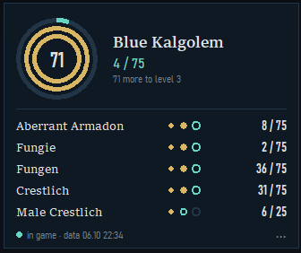

# AION2 pet tracker

A small always-on-top overlay for **Aion 2** that shows your pet (spirit) collection progress for the monster you just killed — including monsters that are already maxed, which the game stops showing.

[Русская версия ниже](#русский)



## Why

Every monster you kill drops spirit points toward its pet entry: **5** to unlock, then **25** for level 2, then **75** for level 3 (the counter resets after each level). Once a monster is maxed, the game no longer shows its progress, yet spirit points keep dropping — so you can't tell whether farming it is still worth it.

The overlay shows, for the monster you just killed:

- the three levels as rings — gold for finished levels, teal for the one in progress;
- how many more kills you need for the next level;
- **MAX +N** once all levels are done, where N is how many points were wasted past the max — a hint that you can skip it;
- a short list of the monsters you killed recently.

## How it works

- **Progress comes from the game's own network traffic.** The overlay reads (never modifies or sends) the packets the server sends to your game client, using [Npcap](https://npcap.com/) — the same approach as DPS meters. When your character enters the world, the server sends the level and points for every monster; each kill then sends the monster ID and the points gained. See [docs/PROTOCOL.md](docs/PROTOCOL.md).
- **Pet names come from the chat.** Packets only carry numeric pet IDs (one per pet — the same pets you can ride once unlocked). When you kill a monster whose pet the overlay hasn't named yet, it reads the system chat line `<Pet>: <message> xN` with Windows' built-in text recognition. A name counts once it has been read twice. The chat tab with system messages has to be visible at that moment. The Russian message text is built in; for other client languages the app learns it on its own after a few kills.
- **Names depend on the game language.** They are stored per client language, and the language is detected from the chat. Players on another language see their own names, not yours. Names that ship with the app live in [data/names.json](data/names.json).

## Install

1. Install **Npcap** (free) from [npcap.com](https://npcap.com/#download). If you use Abyss DPS Meter or Wireshark, you already have it.
2. Download `AION2-pet-tracker.exe` from [Releases](../../releases), put it in its own folder and run it. Windows may warn about an unknown publisher: *More info → Run anyway*.
3. Enter the world with your character (or re-enter from character select) — that's when the server sends your progress.

Requirements:

- Windows 10/11;
- the game in **windowed** or **borderless** mode (an overlay can't draw over exclusive fullscreen);
- the chat visible, so names can be read.

## Usage

- **Move:** drag the overlay anywhere.
- **Tray icon:** click it to hide or show the overlay; its menu also closes the app.
- **Menu:** use **⋯** or right-click. It has opacity, interface language (EN/RU, follows the system by default), game language (detected from chat by default) and clear list.
- **Rename a monster:** right-click its row.
- **Troubleshooting:** run `AION2-pet-tracker.exe --selftest` and check `aion2_pet_tracker.log` next to the exe.

Your progress is saved to `aion2_pet_tracker_state.json` next to the exe, or in `%LOCALAPPDATA%\AION2-pet-tracker` if that folder isn't writable.

## Build from source

```powershell
python -m pip install -r requirements.txt
python aion2_pet_tracker.py          # run from source
.\build.ps1                          # build dist\AION2-pet-tracker.exe
```

`tools/aion2_capture.py` records game traffic with kill markers (F9). Use it to find packets again after a game patch changes the protocol.

## Project layout

| Path | What |
|---|---|
| `aion2_pet_tracker.py` | Overlay: capture, protocol decoding, progress, name reading, UI |
| `data/names.json` | Pet names shipped with the app, per game language |
| `tools/aion2_capture.py` | Traffic recorder for protocol research |
| `docs/PROTOCOL.md` | What is known about the packets |
| `assets/icon.ico` | App icon |
| `build.ps1` | PyInstaller build script |

## Disclaimer

This is an unofficial fan project, not affiliated with NCSOFT. The overlay only reads traffic on your own PC and sends nothing anywhere. Still, the game's terms forbid third-party programs, and anti-cheat software runs on your PC and could in principle notice it (an Npcap driver, an extra window over the game, screenshots taken for name reading). **Use at your own risk.**

## License

[MIT](LICENSE)

---

## Русский

Небольшой оверлей поверх **Aion 2**. Он показывает прогресс коллекции питомцев (очков духа) для только что убитого монстра. В том числе для тех, кто уже заполнен: их игра перестаёт показывать.

**Зачем.** За убийство монстра начисляются очки духа его питомца: **5** для открытия, затем **25** для 2-го уровня и **75** для 3-го. После каждого уровня счётчик обнуляется. Когда все уровни открыты, игра прогресс больше не показывает, а души продолжают выпадать. Оверлей показывает:

- уровни в виде колец;
- сколько ещё нужно убить до следующего уровня;
- **МАКС +N**, если монстр заполнен и его можно не бить.

**Как работает.**

- **Прогресс берётся из сетевого трафика игры.** Трафик только читается через [Npcap](https://npcap.com/), как в DPS-метрах, ничего не изменяется и не отправляется. При входе в мир сервер присылает уровни и очки всех питомцев, а при каждом убийстве — ID питомца и полученные очки.
- **Имена читаются из системной строки чата** «Имя: получены очки духа x1» встроенным распознаванием текста Windows. Имена хранятся отдельно для каждого языка клиента: игрок на другом языке увидит свои имена, а не ваши.

**Установка.**

1. Поставьте [Npcap](https://npcap.com/#download). Если стоит Abyss DPS Meter или Wireshark, он уже есть.
2. Скачайте `AION2-pet-tracker.exe` из [Releases](../../releases) и запустите.
3. Зайдите персонажем в мир.

Игра должна быть в оконном режиме или «окне без рамки», чат должен быть открыт.

**Меню.** «⋯» или правая кнопка мыши: прозрачность, язык интерфейса, язык игры, переименование.

**Трей.** Клик по значку скрывает или показывает оверлей, в меню значка есть «Закрыть».

**Если что-то не работает:** `AION2-pet-tracker.exe --selftest`, затем смотрите `aion2_pet_tracker.log`.

**Риски.** Это неофициальный фан-проект. Программа только читает трафик на вашем компьютере и ничего не отправляет. Но правила NCSOFT запрещают сторонние программы, а античит может заметить драйвер Npcap, окно поверх игры или снимки экрана. **Используете на свой риск.**
